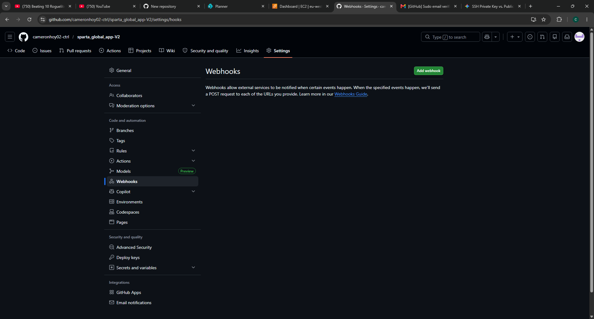
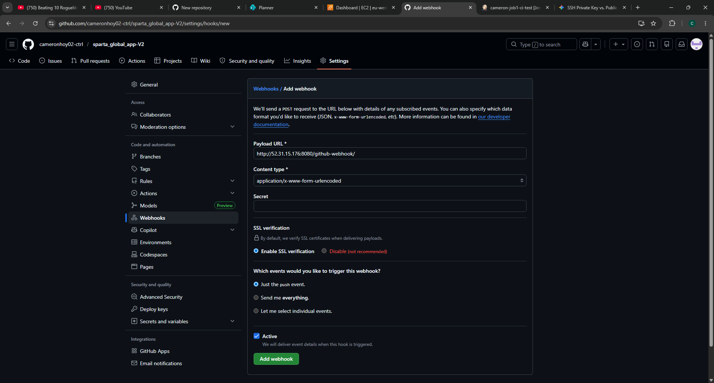

1. Go to the settings in the repo

2. Click webhooks

3. Add webhook

4. Input the jenkins server IP and port, add /github-webhook/

5. On jenkins server check the box for GitHub hook trigger

6. Save