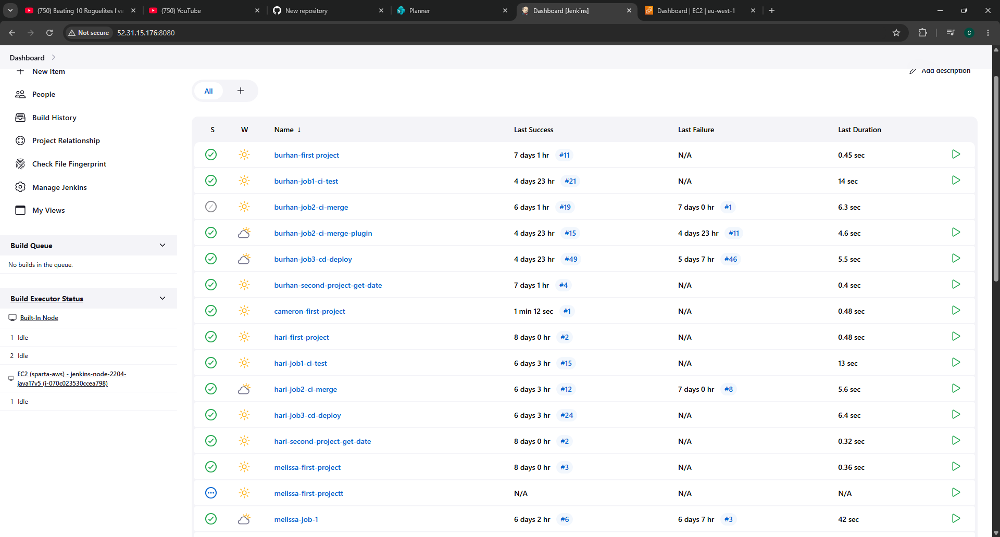
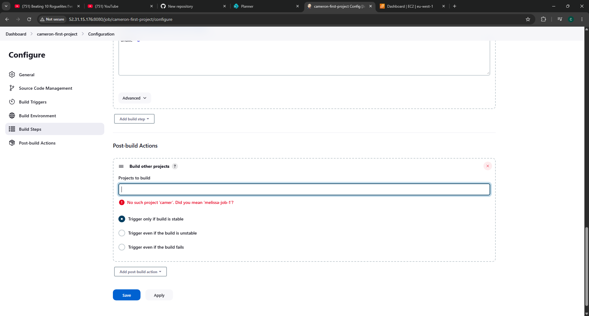
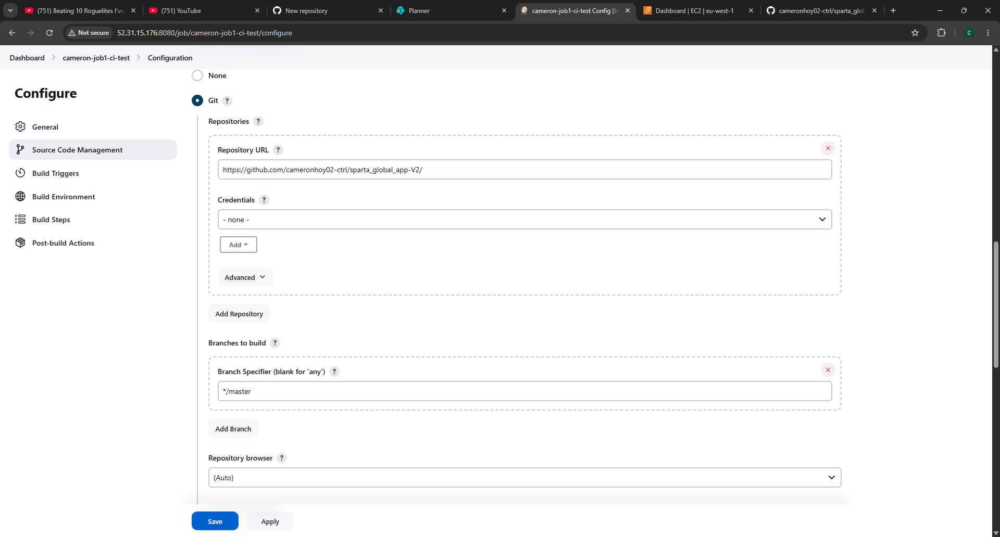
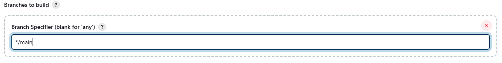
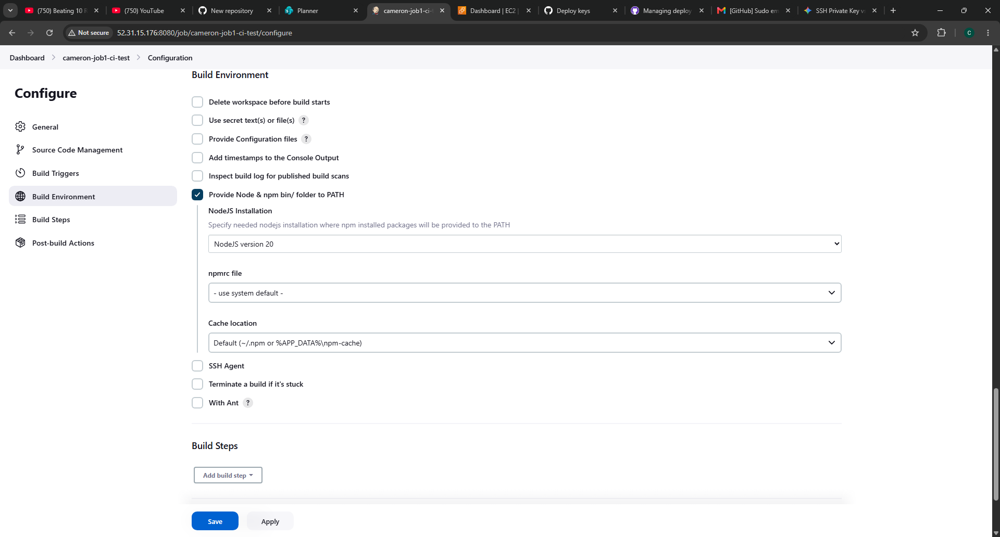
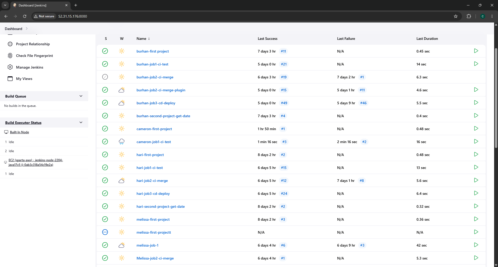
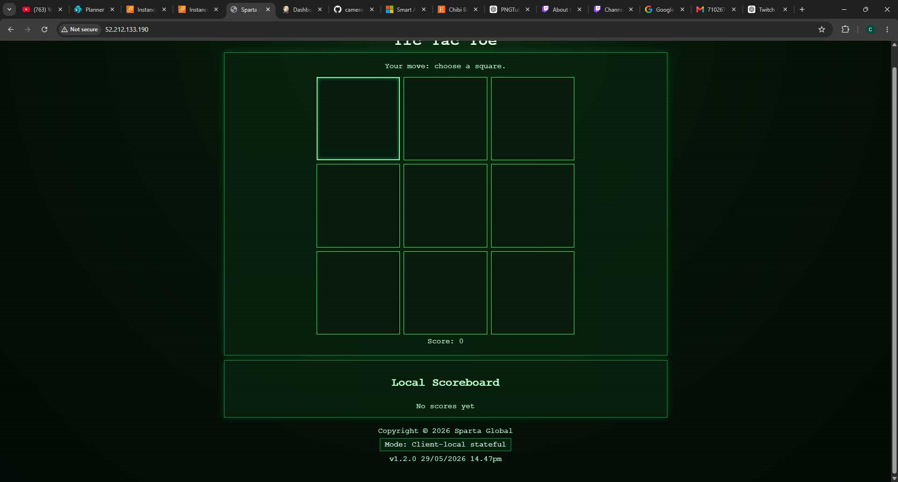
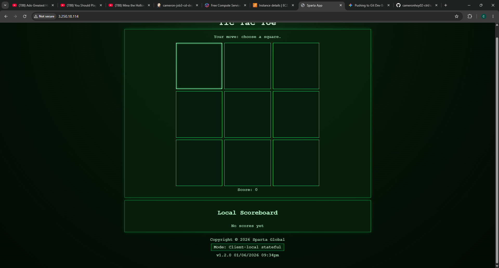

## Test 1 ##


Click New Item

Select Freestyle Project

Discard old builds and set max to 5 (5 builds are saved to review)

Go to Build Steps

Add step as an `excecute shell`

Input uname -a so we can find the version of linux on the ec2 instance

Click build when ready

If a tick is displayed on the dashboard, it is successful



Click New Item


## Test 2 ##


Select Freestyle Project

Discard old builds and set max to 5 (5 builds are saved to review)

Go to Build Steps

Add step as an `excecute shell`

Input date  so we can find the date and time

Click build when ready

If a tick is displayed on the dashboard, it is successful


## Piping ##


Configure the first project

Go to post-build actions

Build other projects



Input the name of job 2

Trigger only if build is stable


## Job 1 ##


Important notes

When creating a job, go to GithubProject if using something like Git for your application

obtain the git http url from your repo

remove the .git at the end of the link and replace it with a /



Change the Branch Specification to `main` from `master`



SSH for Jenkins needs to be the Private key

Ensure you  "Provide Node & npm bin/ folder to PATH as this will give us the npm commands



In build steps (in a command shell) input the following commands: 

`cd app`
`npm ci`
`npm test`

Successful Job!




## Job 2 ##

### Create the Item
1. Navigated to the Jenkins Dashboard and selected **New Item**.
2. Named the item: `cameron-job2-ci-merge`.
3. Selected **Freestyle project** and finalized with **OK**.

### Configure the source code
Configured Jenkins to target the correct repository and branch context:
* **Repository URL:** `git@github.com:cameronhoy02-ctrl/sparta_global_app-V2.git`
* **Credentials:** Selected the verified SSH private key entry (`git`).
* **Branch Specifier:** Set explicitly to `*/dev` to ensure the merge workspace checks out the latest features targeted for integration.

### Step 3.3: Build Triggers (Chaining)
Established the upstream pipeline dependency:
* Enabled the configuration option: **Build after other projects are built**.
* **Projects to watch:** Entered `cameron-job1-ci-test`.
* **Execution Strategy:** Enabled **Trigger only if build is stable** to strictly block unstable code containing broken tests from merging upstream.

### Post-build Actions
Configured the automated Git action that executes once the project workspace clears:
1. Added the **Git Publisher** action block.
2. Enabled **Push Only If Build Succeeds** and **Merge Results**.
3. Under the **Branches** configuration sub-panel:
   * **Branch to push:** Set to `main`
   * **Target remote name:** Set to `origin`

---

## 4. How to manually prompt a change

```bash
# Ensure local workspace is locked to the development branch
git checkout dev

# Make a change to a file in the repository
echo "Testing Jenkins pipeline deployment" >> README.txt

# Stage and commit the revision locally
git add README.txt
git commit -m "Triggering full automated pipeline merge"

# Securely transmit local commits to GitHub using the custom private key
eval "$(ssh-agent -s)"
ssh-add ~/.ssh/tech603-cameron-sparta-app-v2
git push origin dev
```


## Alternate Plugin Method ##


### Step 1: Create the Job

* Click New Item on the Jenkins home dashboard.

* Name it cameron-job2-ci-merge and choose Freestyle project.

### Step 2: Source Code Management (Git)

* Repo URL: git@github.com:cameronhoy02-ctrl/sparta_global_app-V2.git

* Credentials: Select your working OpenSSH private key (git).

* Branch Specifier: Change to */dev (this pulls the fresh code that just passed testing).

### Step 3: Link to Job 1 (Chaining)

* Scroll down to Build Triggers.

* Check Build after other projects are built.

* Projects to watch: Type cameron-job1-ci-test.

* Select Trigger only if build is stable.

### Step 4: Configure the Automated Merge (Git Publisher)

* Scroll down to Post-build Actions and click Add post-build action.

* Select Git Publisher from the dropdown menu.

* Check Push Only If Build Succeeds.

* Check Merge Results.

* Click Add Branches:

* Branch to push: main

* Target remote name: origin

### Step 5: Save

* Click Save at the bottom of the page.


## Job 3 ##


### Step 1: Creating the Jenkins Job

* Headed to the Jenkins Dashboard and clicked New Item.

* Named it cameron-job3-cd-deploy.

* Picked Freestyle project and clicked OK.

### Step 2: Connecting the Source Code (Git)
* Connected this job to the main repo so it grabs the ready-to-deploy code:

* Repository URL: git@github.com:cameronhoy02-ctrl/sparta_global_app-V2.git

* Credentials: Selected the GitHub SSH key.

* Branch Specifier: Set to */main (we only want to deploy code that has passed all tests and merged into main).

### Step 3: Setting up the Pipeline Trigger (Chaining)

* Set this job to run automatically right after the merge job finishes successfully:

* Checked Build after other projects are built.

* Projects to watch: cameron-job2-ci-merge

* Checked Trigger only if build is stable (this acts as a safety guard so broken builds never hit production).

### Step 4: SSH Agent Setup

* In the Build Environment section, checked the box for SSH Agent.

* Selected the AWS private key from the dropdown so Jenkins can securely log into the EC2 instance.

### Step 5: Build Script (Execute Shell)

* Added an Execute shell step.

* Used this script to copy our app/ folder files straight into the Nginx web directory on the server, update the permissions, and restart the web server to push the changes live:
 ``` 
  scp -o StrictHostKeyChecking=no -r app/ ubuntu@172.31.17.134:/home/ubuntu/

ssh -o StrictHostKeyChecking=no ubuntu@172.31.17.134 "cd /home/ubuntu/app && npm install && (pm2 delete sparta-app || true) && pm2 start index.js --name sparta-app"
```
### Build Environment & Credentials
1. Under the **Build Environment** options panel, enabled the **SSH Agent** configuration check.
2. Under the dynamic credentials sub-menu dropdown, selected the registered AWS Private Key

### Build Steps (Execute Shell Configuration)
1. Created an **Execute shell** step within the Build workspace.
2. Injected the final shell configuration routine tailored to isolate and bundle the subfolder `./app/*` directly into the public Nginx tracking directory:

```bash
#!/bin/bash

# Copies the files
scp -o StrictHostKeyChecking=no -r app/ ubuntu@172.31.17.134:/home/ubuntu/

# Sends them to the VM
ssh -o StrictHostKeyChecking=no ubuntu@172.31.17.134 "cd /home/ubuntu/app && npm install && (pm2 delete sparta-app || true) && pm2 start index.js --name sparta-app"
EOF
```

## Screenshots of working pipelines with timestamps



# How and Why We Built Our CI/CD Pipeline

This guide explains why our CI/CD pipeline is set up the way it is, what benefits it brings us, and exactly how the security, triggers, and jobs work behind the scenes.

---

## 1. Why It’s Set Up This Way & Why We Love It

Our pipeline is built on a simple idea: **fail fast**. We structured it as a series of checkpoints that get progressively heavier. It checks the easiest things first (like code formatting) before moving on to time-consuming tasks (like running full test suites or deploying to the cloud). If a developer makes a simple typo, the pipeline catches it in seconds without wasting time or computer power on a full deployment.

### What it does for developers:
* **No more deployment anxiety:** Because tests run automatically every time code is pushed, developers can ship features with confidence instead of just "hoping for the best."
* **It fixes "works on my machine":** Code runs inside a clean, isolated virtual environment. If it works in the pipeline, it will work in production.
* **Easy troubleshooting:** Because we push code in small, frequent updates, if something breaks, it’s incredibly easy to see exactly which line of code caused the issue.
* **Goodbye tedious tasks:** Developers can focus on writing code instead of dealing with manual file transfers, server passwords, or manual build steps.

### What it does for the organization:
* **Faster delivery:** We can get new features and fixes out to customers in hours or minutes, rather than waiting for stressful weekly or monthly release windows.
* **Fewer outages:** By automating everything, we eliminate human error—which is the number one cause of broken production systems.
* **Built-in safety nets:** If a new update causes an issue in production, the system can automatically roll back to the previous working version instantly.
* **Clear paper trail:** The pipeline acts as a built-in history book. We always know exactly who approved a change, what tests it passed, and when it went live.

---

## 2. How the Pipeline Starts (Triggers & Webhooks)

Instead of our pipeline server constantly checking the code repository for updates, we use an automated notification system called a **webhook**. 

1. **The Handshake:** When something happens in our code repository (like GitHub or GitLab), it instantly sends a message to our CI/CD server.
2. **The Security (Webhook Secret):** To make sure a random stranger can't send a fake message and trigger our pipeline, the code repository signs every message with a secret password (an HMAC token). Our CI/CD server verifies this signature before running anything.
3. **The Rules:** * **Pull Requests (Proposed Changes):** This only triggers the early checks—linting, security scanning, and unit tests. We want to make sure the code is healthy *before* anyone reviews it.
   * **Merges to Main (Approved Changes):** This triggers the full pipeline, including building the final package and deploying it to the cloud.

---

## 3. The Step-by-Step Jobs & How We Keep Them Secure

Every job runs inside its own temporary, clean container that is completely wiped clean when the job finishes. Here is what happens step-by-step:

### Job 1: Code Formatting & Quality (Linting)
* **What it does:** It checks the code for style, formatting, and syntax errors. 
* **Security:** This job is entirely self-contained. It only reads the code and doesn't need access to any databases or cloud servers.

### Job 2: Security Scans
* **What it does:** It looks for vulnerable code patterns and checks to make sure a developer didn't accidentally leave a password or API key exposed in the source code.
* **Security:** If it finds a critical security flaw or an exposed password, **the pipeline stops immediately** so the security risk never leaves the developer's branch.

### Job 3: Automated Testing
* **What it does:** It runs our automated test suite to make sure the new code doesn't break existing features.
* **Security:** If the tests need a database, the pipeline spins up a temporary, empty database container just for the test, then deletes it right after. **We never use real production data for tests.**

### Job 4: Packaging the Code (The Build Stage)
* **What it does:** It bundles the application into a single, unchangeable package (like a Docker image) that is ready to run.
* **Security:** The pipeline needs to save this package to a secure registry. Instead of using hardcoded passwords that could be stolen, it uses **OIDC (OpenID Connect)**. This allows the pipeline to request a temporary, 5-minute digital key from the cloud provider just to upload the file, eliminating permanent passwords entirely.

### Job 5: Deployment
* **What it does:** It takes our packaged application and pushes it live to our cloud hosting environment.
* **Security:** The pipeline uses a highly restricted service account that *only* has permission to update the specific app, nothing else. Furthermore, deploying to production requires a team member to click a physical "Approve" button in the pipeline portal before it actually goes live.

---

## 4. What Success Looks Like at the End

## When the pipeline finishes successfully, three things happen:

1. **The app is live:** The new code is running in production with zero downtime for our users.
2. **We have a backup ready:** A perfectly packaged version of this exact build is saved in our history registry. If we ever need to scale up or roll back, we can do it instantly.
3. **Everyone is notified:** The repository gets a green checkmark, and a notification is sent to our team chat (like Slack or Teams) letting everyone know the deployment was a success.

## How the Webhook Works (The Pipeline Trigger)

Think of a webhook as a digital **doorbell**. Instead of our CI/CD server constantly staring out the window to see if a developer has written new code, the code repository (like GitHub or GitLab) simply rings the doorbell the exact second a change happens.

---

### 1. How It’s Set Up
Setting it up is simple. Inside our repository settings, we give it two things:
* **The Address (Payload URL):** This tells the repository exactly where our CI/CD server lives on the internet.
* **The Secret Key:** A unique, private password known only to our repository and our CI/CD server.

---

### 2. How We Keep It Secure
Because our CI/CD server is listening for messages from the internet, we have to make sure hackers can't send fake messages to trigger random deployments. 

To prevent this, we use a security handshake called **Signature Verification**:
1. **The Stamp:** Every time the repository sends a message, it uses our **Secret Key** to stamp a unique digital signature onto the package.
2. **The Check:** When our CI/CD server receives the message, it checks the stamp against its own key. If it matches, the server says, *"Great, this is really from our team,"* and starts the job. If the stamp is missing or wrong, the server ignores it completely.

---

### 3. The Rules (What Happens When)
We don't need to run a full deployment every single time a developer saves their work. The webhook tells the server exactly *what* just happened, allowing us to split the work into two simple paths:

#### Path A: The Pre-Merge Test (When a developer asks for feedback)
* **The Trigger:** A developer opens a Pull Request (PR) to merge their work into the main codebase.
* **What happens:** The pipeline only runs the quick safety checks (formatting, security scans, and basic tests). 
* **The Goal:** Make sure the code is safe and working *before* another teammate spends time reviewing it.

#### Path B: The Live Release (When code is officially approved)
* **The Trigger:** The Pull Request is approved and officially merged into the `main` branch.
* **What happens:** This triggers the big guns. The pipeline packages up the code, runs the final checks, and pushes the updates live to our cloud servers.
* **The Goal:** Get the new features out to our users automatically and with zero downtime.